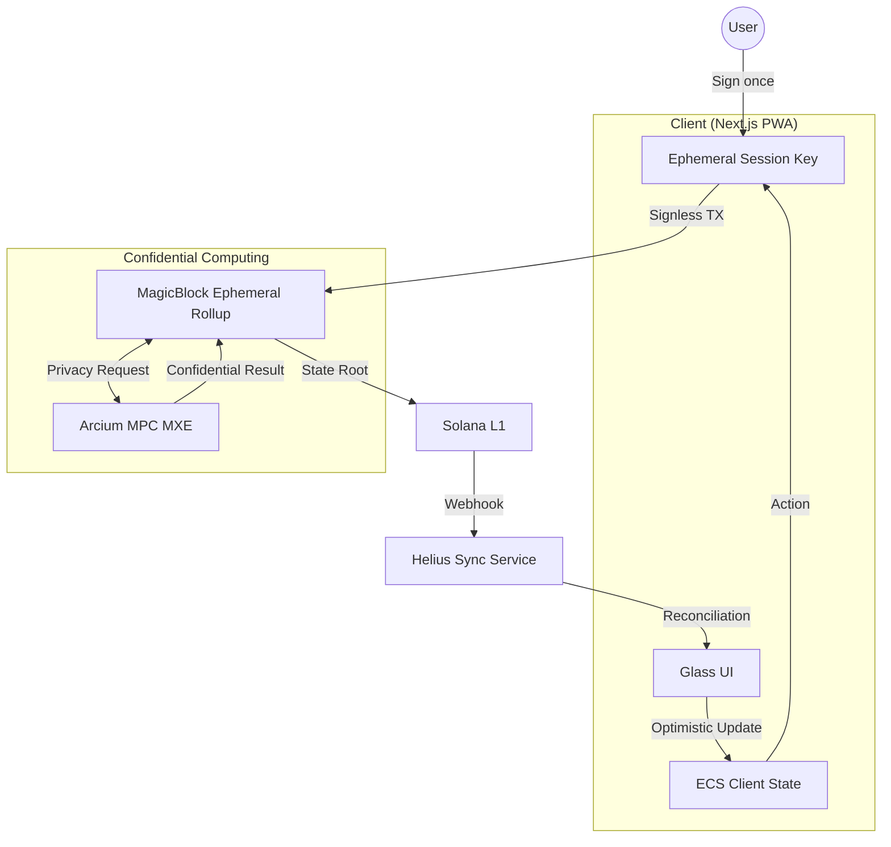

# Architecture Deep Dive: house.fun vs. Industry 2026 Standards

This analysis compares our current implementation against the "State-of-the-Art" (SOTA) patterns emerging in the 2026 Solana gaming ecosystem.

---

## 🏗️ Architecture Matrix

| Feature | Current `house.fun` (Demo Phase) | Production Goal (develop Phase) | Tech Stack |
| :--- | :--- | :--- | :--- |
| **User Flow** | Wallet popup for initial joins. | Session Keys (Sign-once, play for 1hr). | **MagicBlock** |
| **Logic** | High-performance local loops. | 1ms tick rate Rollup state. | **MagicBlock / Bolt** |
| **Privacy** | Commitment schemes (Flip It). | MPC Confidential Shuffle (All games). | **Arcium MXE** |
| **Display** | Premium Glassmorphism + PWA. | Real-time Social HFT Feed. | **Next.js 15 / Helius** |
| **Fees** | User pays per action (on L1). | House-sponsored gas (on Rollup). | **Account Abstraction** |

---

## 🕵️ Post-Submission "Gap" Analysis

### 1. From Simulation to Rollup
While our current "Demo Mode" engines enable smooth evaluation, true production scale requires moving the game loop off L1.
> **Next Step**: Implement the **Bolt ECS** framework. Game entities (hands, bets, horses) will be processed on a MagicBlock Rollup every 10ms, settling the final state root to Solana L1 only when the pot is awarded.

### 2. Confidential State (The Arcium Edge)
We successfully integrated Arcium for `Flip It`. Now we must expand this to the more complex requirements of Poker.
> **Next Step**: The `Arcium MXE` will generate a deck of 52 encrypted indices. Players will receive decryption keys for their specific hole cards. This physically prevents the house from seeing the cards in memory.

### 3. Friction Removal
The current wallet-heavy experience is a bottleneck for high-frequency betting.
> **Next Step**: Implementation of **Session Keys**. A user signs one authorization at the start of their session, delegating authority to a restricted local keypair for the duration of the match.

---

## 🚀 The Post-Submission Architecture

---
*Last Updated: 2026-02-27 (Post-Submission Update)*
