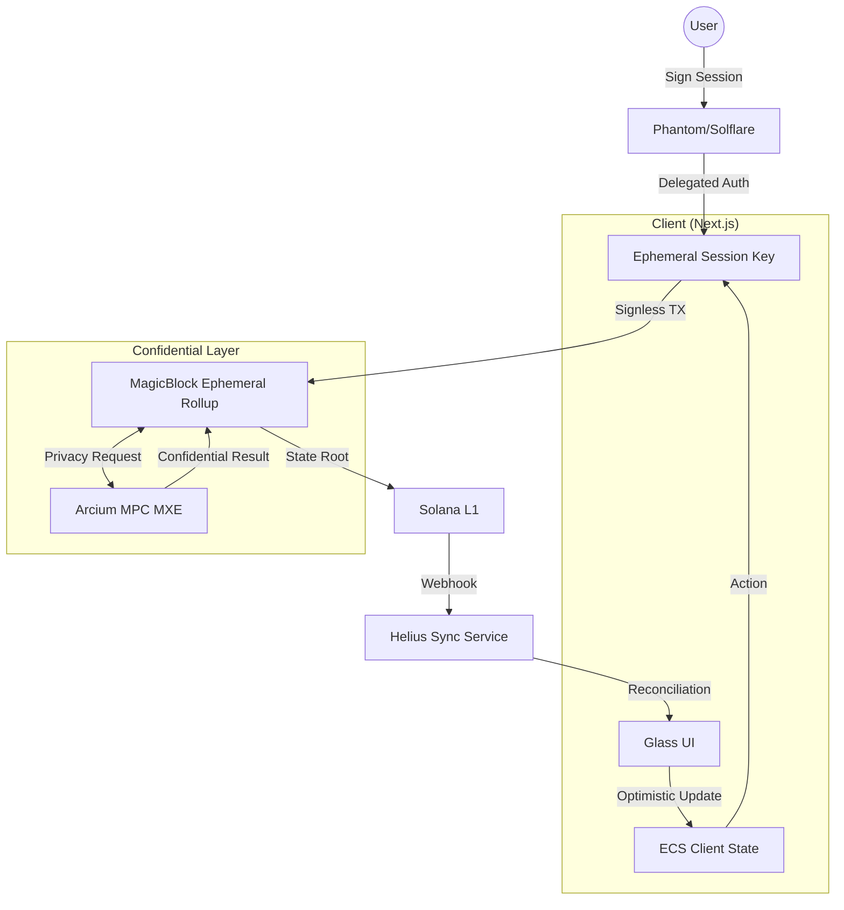

# Architecture Deep Dive: house.fun vs. Industry 2026 Standards

This analysis compares our current implementation against the "State-of-the-Art" (SOTA) patterns emerging in the 2026 Solana gaming ecosystem.

---

## 🏗️ Current vs. Better Version

| Feature | Current `house.fun` | Industry Standard (SOTA) | Our "Better Version" Goal |
| :--- | :--- | :--- | :--- |
| **User Friction** | Wallet popup for every bet/action. | Session Keys (Sign-once, play for 1hr). | **MagicBlock Session Keys Integration**. |
| **Latency** | 400ms - 2s (L1/Simulated delays). | 1ms - 50ms (Ephemeral Rollups). | **Native Ephemeral Rollup ECS**. |
| **Data Privacy** | Client-side "Lock" visuals (Simulated). | MPC / TEE Confidential State. | **Arcium MPC Confidential Shuffle**. |
| **State Sync** | React State + `setTimeout`. | Entity-Component-System (ECS). | **Bolt/MagicBlock ECS Framework**. |
| **Gas/Fees** | User pays per action. | Account Abstraction (Paymasters). | **Gasless Gaming (House-sponsored)**. |

---

## 🕵️ The "Gap" Analysis

### 1. The "Confirmation Fatigue" Problem
Our current architecture uses a standard `useWallet` hook. In Poker, if a player has to click "Approve" for every *Check*, *Fold*, or *Raise*, the game becomes unplayable.
> **Fix**: Implement **Session Keys**. The user signs a single transaction at the start that delegates authority to an ephemeral key stored in the browser's session storage. This key can only call `poker_action` instructions and is capped at the user's buy-in amount.

### 2. High-Frequency State Synchronization
We are currently "polling" or using simulated delays. In a fast-paced environment like **Degen Derby** or **Shadow Poker**, the UI must be optimistic.
> **Fix**: Move to an **ECS (Entity-Component-System)** architecture. Game objects (Players, Cards, Bets) are entities. Systems (Shuffle, Bet, Win) process these entities every "tick" (10ms) on an Ephemeral Rollup.

### 3. Oracle & Reconciliation (The Observer)
We lack a service that reconciles the "On-Chain Reality" with the "UI Display" if a user loses connection.
> **Fix**: Implement a **Vibe-Listener** service using Helius Webhooks to push real-time on-chain events via WebSockets to the frontend, ensuring the state is never "stuck."

---

## 🚀 The "Better Version" Architecture

---

## 🛠️ Implementation Strategy (Phase 1-2)

### A. Session Keys (MagicBlock)
1.  **Authorize**: User joins table and signs an "Authorization" instruction.
2.  **Ephemeral Key**: Generate a local `Ed25519` keypair.
3.  **Interaction**: The `handlePlayerAction` hook uses the local key to sign, resulting in **zero popups** during the match.

### B. Arcium Confidential Shuffle
1.  **Phase 0 (Current)**: Client "pretends" cards are locked.
2.  **Better Version**: 
    *   The `Arcium MXE` generates a deck of 52 encrypted indices.
    *   Validators shuffle the encrypted indices.
    *   The user receives their 2 indices and a **Decryption Key** specific to their public key.
    *   The house/validators **cannot** see the indices even though they participate in the shuffle.

---

## 🏆 Recommendation
To achieve a "Winning" hackathon entry, we must prioritize **removing the wallet popup** via Session Keys and **moving the game loop** to a real MagicBlock Rollup. This transforms `house.fun` from a "Site" into a "Game Engine."
